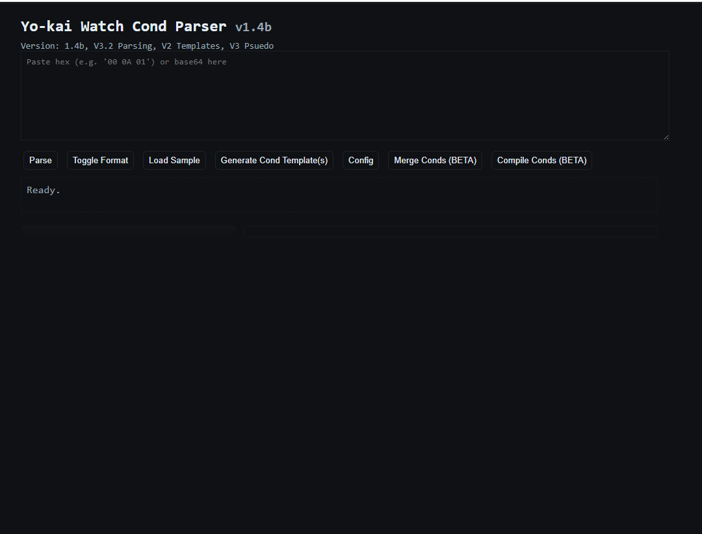
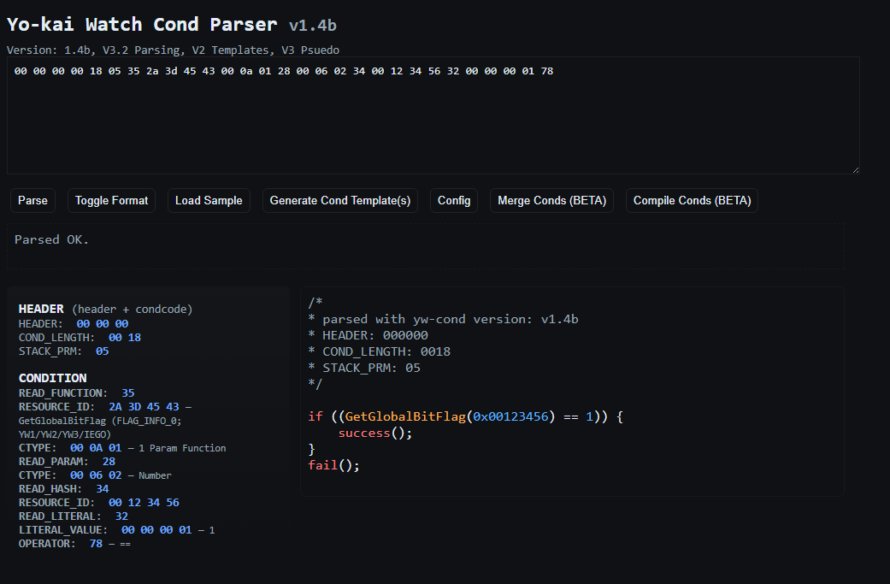

## Usage Guide
This section will explain how to use the web UI of `yw-cond`. First, let's open the website - you can open the website [by clicking this link](https://n123git.github.io/yw-cond). You should see something like this:

Next, we'll load a random sample CExpression (or 'Cond') to demonstrate, we can do this by clicking *Load Sample* (*Charger un échantillon* in French). This loads a sample from a pre-defined sample list, shuffling in order (mostly used for testing):

The $\color{#E81B1B}{■}$ (red) section is where you paste in your CExpression, it can be in base64 i.e. `AAAAABgFNSo9RUMACgEoAAYCNAASNFYyAAAAAXg=` or in hex as shown by the image.
The $\color{#3D00BA}{■}$ (purple) section will display errors if they appear. These should never occur in practice however.
The $\color{#FFAB00}{■}$ (orange) section displays a C/C++ decompilation of the CExpression to show the behaviour of the CExpression.
The $\color{#27F200}{■}$ (green) section displays a 1:1 breakdown of all the bytes within the CExpression and their purpose - this is for people who understand the format - it can also be used for debugging.
Next, let's go over the buttons on the sidebar:
* *Parse* (*Analyser* in French) parses and analyses the cond in the textarea ($\color{#E81B1B}{■}$ (red) section)
  * *Load Sample* (*Charger un échantillon* in French) automatically runs this, same for *Toggle Format* (*Changer de format*)
  * Clicking *Parse* when the textarea is empty will clear the $\color{#FFAB00}{■}$ (orange), $\color{#27F200}{■}$ (green) and $\color{#3D00BA}{■}$ (purple) sections.
* *Toggle Format* (*Changer de format* in French) converts the CExpression in the textarea ($\color{#E81B1B}{■}$ (red) section) from base64 -> hex and vice versa. It also automatically runs the *Parse* (*Analyser*) button.
* *Load Sample* (*Charger un échantillon* in French) loads a sample from a pre-defined sample list, shuffling in order (mostly used for testing). It also automatically clicks the *Parse* (*Analyser* in French) button.
* *Generate Cond Template(s)* (*Générer modèles Cond* in French) opens a modal where you can select several predefined CExpressions i.e. Watch Rank, Weather etc
* *Config* (*Config* in French) allows you to configure several options which range from decompiler changes, to aesthetic changes to debug mode. These are saved to `localStorage` automatically. Each option explains it's purpose so they will not be covered here for now.
* *Merge Conds* (*Fusionner Conds* in French)  allows you to merge conds automatically. As of v1.4b the following modes are supported:
  * *AND* - requires both Conds to succeed for the merged Cond to
  * *OR* - requires either Cond to succeed
  * *XNOR/EQV* - suceeds if both Conds fail OR if both Conds suceed. That is, their state is equivalent.
  * *NAND* - succeeds unless both Conds do.
* *Compile Conds* (Compiler Conds in French) from v1.4b onwards allows you to compile completely custom CExpressions see the Compiler Syntax section for a guide on this. 
## Common CExpression Functions
There are **ALOT** of functions that CExpressions can call - over 118 in yw1 alone! This section will explain the most common ones you'll frequently see:

* `GetPhase()` - no params; returns the current Phase
  * This is calculated as `(chapter_no * 10,000) + sub_phase_no` (official names extracted from yw4 save files).
  * Take for instance `40010` this means the player is in Chapter 4, with a subphase of 10 which is near the start of the Chapter.
* `GameClear()` - no params; returns a Boolean value.
  * Returns 1 if the player has completed the main story (post-game isn't needed) else 0.
