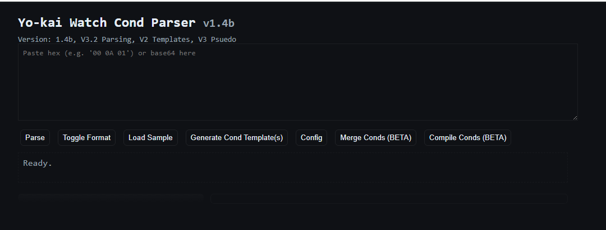
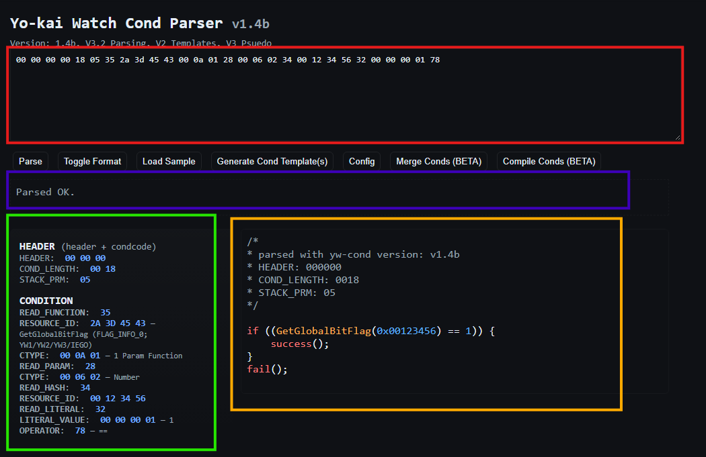

# Usage Guide

This guide explains how to use the yw-cond website to parse, analyze, decompile and compile CExpressions (colloquially called Conds and historically PhaseAppear).

To use the tool, open (or download) the website from [here](https://n123git.github.io/yw-cond).

First of all, I should explain **what** a CExpression is. A CExpression (Cond) is a recursive RPN bytecode format used in Level5 games from IEGO onwards to evaluate runtime conditions without the overhead of a scripting language like XQ and without hardcoding into the binary. Read the README for more information and the format documentation for (well its pretty self-explanatory) format documentation)

## HTML UI Documentation

When you open the site, you should see something like this:



However, after clicking Load Sample, you should see something like this:



The interface is divided into four sections which I've colour-coded above gor reference:

* 🔴 Input Area
  * Paste your CExpression here (supports base64 and hex)
   * Colours are cool (Emojis looked better than plaintext)

* 🟣 Error Section
  * Displays parsing errors (these should not normally occur but until v1.4 parsing errors could occur in certain valid CExpressions)

* 🟠 Decompiler 
  * Shows a pseudo C/C++ decompilation of the CExpression - this mostly follows the Compiler Syntax but wraps it into if statements to show the conditional side of CExpressions.

* 🟢 Byte Breakdown
  * I totally did NOT spend 10 minutes trying to come up with a good name (I clearly failed :p)
  * Displays a detailed byte-by-byte structure. This is an advanced section and is mainly used for debugging  - especially historically when the Decompiler wasnt exactly the best.

## Buttons

> Note: Some actions such as Load Sample and Toggle Format automatically run Parse.

### Parse (Analyser)

Parses and analyses the CExpression in the input area. Note that if the input is empty, all output sections will be cleared (originally there was a Clear button but to save space these were merged).

### Toggle Format (Changer de format)

Converts the CExpression between base64 and hex. This automatically runs Parse after conversion.

### Load Sample (Charger un échantillon)

Loads a predefined sample and automatically parses it.

### Generate Cond Template(s) (Générer modèles Cond)

Opens a modal where you can select predefined CExpression templates (e.g. Watch Rank, Weather, etc) and fill in parameters.

### Config

Allows you to configure decompiler behaviour, UI settings, debug settings etc. All settings are automatically saved to `localStorage`.

### Merge Conds (BETA)

Allows you to combine two CExpressions using logical operations, the following are supported:

* AND - both Conds must succeed
* OR - either Cond must succeed
* XNOR / EQV - succeeds if both Conds have the same result
* NAND - succeeds unless both Conds succeed

This is mainly intended for people who struggle with using the Compiler.

### Compile Conds (BETA)

Allows compiling custom expressions into CExpressions.
See Compiler Syntax in its respective section.

## Common CExpression Functions

Yo-kai Watch 1 alone supports over 100 CExpression functions. The table below lists some of the most commonly used ones, their parameters, and functions:

| Function | Parameters | Return Type | Description |
|----------|-----------|------------|-------------|
| `GetPhase()` | None | Integer | Returns the current phase, calculated as (chapter_no * 10,000) + sub_phase_no |
| `GameClear()` | None | Integer (Boolean) | Returns 1 if the main story is completed, else 0 |
| `RunTrigger(hash)` | TriggerID | Constant `1` | Executes a trigger by ID (scope-dependent) |
| `IsHaveItem(hash)` | ItemID | Integer (Boolean) | Returns 1 if the player has the item, else 0 |
| `GetQuestPhase(hash)` | QuestID | Integer | Returns quest progress (00 = not started, FF/255 = completed) |
| `GetGlobalByteFlag(hash)` | FlagID | Integer | Gets a GlobalByteFlag value (0–255) |
| `SetGlobalByteFlag(hash, value)` | FlagID, Value | Constant `1` | Sets a GlobalByteFlag (0–255) |
| `GetGlobalBitFlag(hash)` | FlagID | Integer (Boolean) | Gets a GlobalBitFlag (0/1) |
| `SetGlobalBitFlag(hash, value)` | FlagID, Value | Constant `1` | Sets a GlobalBitFlag (0/1) |

### Compiler Syntax

The compiler accepts standard infix expressions similar to C++. Take for instance:

```js
(GetPhase() >= 40010) && GameClear() ; hi how are you!
```

This checks whether the player:
* Is at least near the start of Chapter 4
* Has completed the game
Of course, the first check is redundant but this is just for demonstration :p


#### Supported Elements

##### Comments

Single-line comments beginning with `;`. Everything following ; on that line is ignored by the compiler. Take for instance:

```asm
  ; This is a single-line comments and Wondernyan is cool
```

##### Integer Literals
These are standard signed 32-bit integers. The compiler will automatically error if you attempt to define an out of range Integer literal. Examples include (yes I'm not defining a code block for this one) 1, 0, -3, and -10000

##### Hex Literals

These are also signed 32-bit integers. These behave identically to integer literals at runtime, but differ both in when they are used and encoding within the format. Use these for IDs and other hashes. Examples include:

```cpp
0x1234
0xDEADBEEF
0xdeadbeef
0xFFFFFFFF ; you can NOT do -0x1 should probably change that
```

##### Char Literals

A single-byte alias for hex literals, denoted using single quotes. These are limited to one character. Examples can be found below:

```ini
' ' ; becomes 0x20
'\\' ; is just one character
'A'
```

##### Float Literals

These are IEEE-754 single-precision floating-point values.

They can be written using many different notations:
* Decimal notation
* f suffix
* Scientific notation
* Special values such as Infinity, NaN, -Infinity
Here are some of many possible floats:

```python
3.0
3f
3F
-.0f
3e5
3E5f
Infinity
Inf
INF
iNf
NaN
nan
-NAN ; negative NaN just becomes NaN during compilation
```

##### Function Calls

Functions are written as identifiers followed by parentheses, optionally containing expressions as parameters:

```js
GetMoney()
SetGlobalByteFlag(0x12345678, GetGlobalByteFlag(0x12345678) + 1)
```

Additionally, unknown functions can be referenced using their CRC-32 hash (I moved it down here for the next part):

```js
FUNC_BF7BF3F5()
```

From v1.4b onwards, all CExpression functions used in the Nintendo 3DS Yo-kai Watch games have been mapped.
However, hashed function usage may still appear in Nintendo Switch CExpressions and other Level5 games. Support for other games is not a primary focus but may work due to format similarities, and additional support can be added on request.

##### Operators

Expressions use standard infix notation (e.g. 3 + 2, not 3 2 +). Operator precedence follows C++ rules, with brackets being supported.

##### Operator Table

| Symbol | Precedence | Operation |
|--------|----------|----------|
| * / % | 13 | Multiply / Divide / Remainder |
| + - | 12 | Addition / Subtraction |
| << >> | 11 | Bit shifting |
| < <= > >= | 10 | Relational comparison |
| == != | 9 | Equality comparison |
| & ^ \| | 8–6 | Bitwise operations |
| && | 5 | Logical AND |
| \|\| | 4 | Logical OR |
